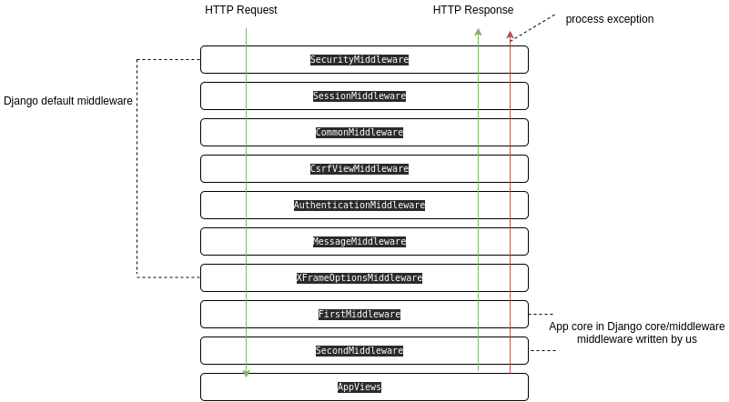

# Что такое Middleware?

По сути это оболочка приложения между http запросов и http ответа.
Где проихсодит какая-то логика проверки и выдачи исключений.
Промежуточное ПО

Пример:

[DjangoExample/core/middleware.py](DjangoExample/core/middleware.py)

